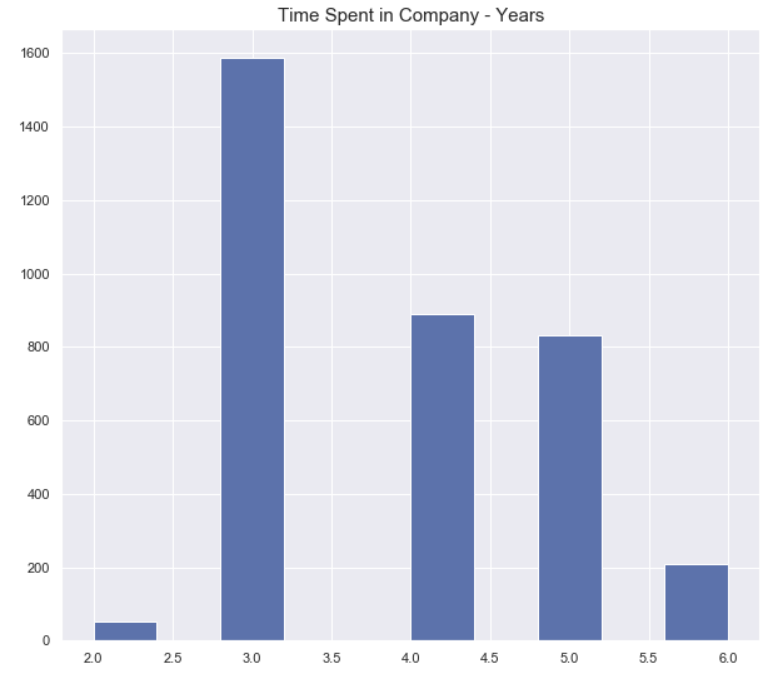

# Predicting Employee-Attrition with Python
## Business Problem
Employee attrition refers to the rate at which employees leave their jobs and are replaced by new employees. Attrition can be voluntary, where employees choose to leave their jobs, or involuntary, where employees are let go by the company. Attrition can be caused by various factors, including job dissatisfaction, lack of growth opportunities, inadequate compensation, poor working conditions, or personal reasons. High levels of attrition can be a concern for companies, as it can lead to increased recruitment costs, decreased productivity, and lower morale among remaining employees.This is why undertanding employee attrition is important for businesses in order to improve their bottom line, maintain productivity, boost morale, and enhance their reputation as an employer.

## Data Understanding
The data is for company X which is trying to control attrition. There are two sets of data: “Existing employees” and “Employees who have left”. Following attributes are available for every employee.
  * Satisfaction Level
  * Last evaluation
  * Number of projects
  * Average monthly hours
  * Time spent at the company
  * Whether they have had a work accident
  * Whether they have had a promotion in the last 5 years
  * Departments (column sales)
  * Salary
  * Whether the employee has left
### Objective
What type of employees are leaving? Determine which employees are prone to leave next.

## Data Exploration and Preparation
### Data Exploration
In this stage, I will be assessing the variables in the data in order to understand their distribution and how they might contribute to employee attrition.
#### Satisfaction Level
  

From the histogram above, we can deduce that people with lower satisfaction level are more likely to leave the company.
#### Last Evaluation
  

We can see from the chart above that people with both low and high evaluations are leaving the company.
#### Number of Projects
  

The histogram above shows that people with small and big number of projects are leaving the company however, people with 2 or less projects are more likely to leave.
#### Average Monthly Hours
  

From the chart above, we can deduce that average montly hours has litlle effect on whether a person decides to leave as there are lots of people with low hours as well lots of people with more hours leaving.
#### Time Spent in Company (Years)  
  

From the chart above, we can see that new entrants into the company are less likely to leave, however a lot of people starts leaving the company after 3 years. Most people leaving have spent between 3-5 years at the company. The rate however goes lower as they spend more years in the company.
#### Work Accident
  

Most people leaving the company had no history of work accident, therefore accident has little to no role to play in why peeople are leaving the company.
#### Promotion in the Last Five Years
  

Every one who left the company had no promotion in the last 5 years. This is a strong indication as to why people are leaving the company. Employees are likely leave a company if there's no chance for growth and advancement to seek it elsewhere.
#### Departments
  

Employees are leaving from all departments however, the rate at which they leave from the various departments differs from one another. Sales has the highest rate among employees leaving while management has the lowest.
#### Salary
  
Salary seems to be another strong indication as to why people are leaving. Majority of those who left the company are being paid low salaries. The rate of people leaving diminishes as their salary increases. People with high salaries seems less likely to leave the company.

Now that we have evaluated the ex-employee data, we will use information from this data to build a model that predicts the likelihood of an employee, leaving the company. Before we can do that, we need to prepare to ensure that it is in the right shape for modelling.
### Data Preparation
There are two datasets, one for current employees and the other for ex-employees. These two datasets will be merged and a new column will be created showing the employee status as either 'current' or 'ex'. This will enable us differentiate the two sets of employees in the merged data.  

  

Other data preparation steps carried out are as follows:
  

  

  

## Modelling 
### Model Training
 

### Model Evaluaion
 

### Model Chart
This is a plot of the actual values and the predicted values.  
 
## Conclusion and Recommendation
The explorative data analysis revealed some interesting insights:
  * Employees with low satisfaction are more likely to leave the company
  * People with 2 or less projects are more likely to leave than people with higher number of projects.
  * Most people leaving have spent between 3-5 years at the company. 
  * Everyone who left the company had no promotion in the last 5 years.
  * Sales has the highest rate among employees leaving while management has the lowest. 
  * Majority of those who left the company are being paid low salaries. The rate of people leaving diminishes as their salary increases.  

Recommendations:  
  * The company has to interact with employees with low satisfaction level to find out their pain points and how to make it better.
  * The company needs to engage their workers with more project, employees that perform the same tasks constantly will be bored and might seek excitement elsewhere.
  * Everyone leaving have not been promoted in the last 5 years. This could also explain why employees leave after 3 – 5 years. Employees come in with hope for growth and advancement, if they don't get it, the will seek it elsewhere. The company therefore has to promote staffs and create opportunities for growth.
  * The company also has to review its salaries as most employees who left were getting a low salary.

 
 

